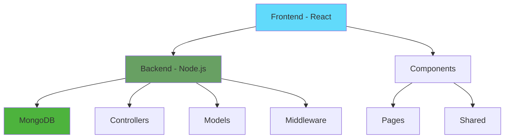
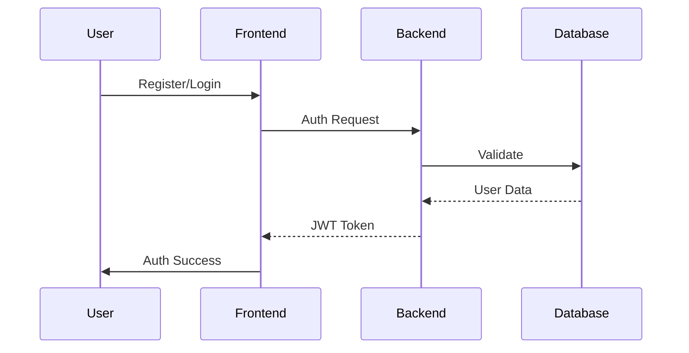
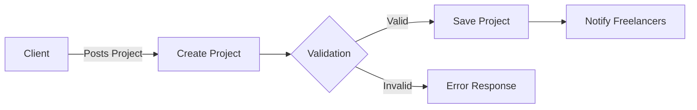

Collecting workspace informationFiltering to most relevant informationHere's a detailed README.md with diagrams and comprehensive documentation:

# Freelancer Platform

A full-stack freelancing platform connecting talented professionals with clients worldwide. Built with React, Node.js, and MongoDB.

## 🏗️ Architecture



## 🔧 Tech Stack

### Frontend
- React with Vite
- TailwindCSS for styling
- GSAP for animations
- React Router for navigation
- Axios for API calls

### Backend
- Node.js/Express
- MongoDB
- JWT Authentication
- Multer for file uploads
- Google OAuth integration

## 📁 Project Structure

```
project/
├── frontend/
│   ├── src/
│   │   ├── pages/
│   │   │   ├── Home.jsx
│   │   │   ├── Profile.jsx
│   │   │   ├── PostProject.jsx
│   │   │   └── ProService.jsx
│   │   ├── components/
│   │   └── assets/
│   └── package.json
│
├── backend/
│   ├── controllers/
│   │   ├── userController.js
│   │   ├── postController.js
│   │   └── paymentController.js
│   ├── models/
│   ├── middleware/
│   └── routes/
```

## 🚀 Features

### User Management


### Project Posting


## 🛠️ Setup & Installation

```bash
# Clone repository
git clone <repository-url>

# Frontend setup
cd frontend
npm install
npm run dev

# Backend setup
cd backend
npm install
npm start
```

## 🔐 Environment Variables

```env
# Frontend
VITE_API_URL=http://localhost:9090
VITE_GOOGLE_CLIENT_ID=your_client_id

# Backend
MONGODB_URI=your_mongodb_uri
JWT_SECRET=your_jwt_secret
GOOGLE_CLIENT_ID=your_client_id
```

## 📱 Core Features

1. **User Authentication**
   - Email/Password login
   - Google OAuth integration
   - JWT token-based auth

2. **Project Management**
   - Post new projects
   - Bid on projects
   - Real-time updates

3. **Profile System**
   - Portfolio management
   - Skill showcase
   - Work history

4. **Payment Integration**
   - Secure payments
   - Multiple payment methods
   - Escrow system

## 🔄 API Endpoints

```mermaid
graph LR
    A[API Routes] --> B[/api/auth]
    A --> C[/api/projects]
    A --> D[/api/users]
    A --> E[/api/payments]
    
    B --> B1[POST /login]
    B --> B2[POST /register]
    
    C --> C1[GET /projects]
    C --> C2[POST /projects]
    
    style A fill:#ff9900
```

## 👥 Contributing Guidelines

1. Fork the repository
2. Create feature branch
3. Commit changes
4. Push to branch
5. Create Pull Request

## 📄 License

MIT License - See LICENSE for details

## 📞 Support

For support, email support@freelancer-platform.com or join our Slack channel.

---
Made with ❤️ by Your Team Name
graph TD
    A[Frontend - React] --> B[Backend - Node.js]
    B --> C[MongoDB]
    
    A --> D[Components]
    D --> D1[Pages]
    D --> D2[Shared]
    
    B --> E[Controllers]
    B --> F[Models]
    B --> G[Middleware]
    
    style A fill:#61DAFB
    style B fill:#68A063
    style C fill:#4DB33D

project/
├── frontend/
│   ├── src/
│   │   ├── pages/
│   │   │   ├── Home.jsx
│   │   │   ├── Profile.jsx
│   │   │   ├── PostProject.jsx
│   │   │   └── ProService.jsx
│   │   ├── components/
│   │   └── assets/
│   └── package.json
│
├── backend/
│   ├── controllers/
│   │   ├── userController.js
│   │   ├── postController.js
│   │   └── paymentController.js
│   ├── models/
│   ├── middleware/
│   └── routes/

sequenceDiagram
    User->>Frontend: Register/Login
    Frontend->>Backend: Auth Request
    Backend->>Database: Validate
    Database-->>Backend: User Data
    Backend-->>Frontend: JWT Token
    Frontend->>User: Auth Success

flowchart LR
    A[Client] -->|Posts Project| B[Create Project]
    B --> C{Validation}
    C -->|Valid| D[Save Project]
    C -->|Invalid| E[Error Response]
    D --> F[Notify Freelancers]

# Clone repository
git clone <repository-url>

# Frontend setup
cd frontend
npm install
npm run dev

# Backend setup
cd backend
npm install
npm start

# Frontend
VITE_API_URL=http://localhost:9090
VITE_GOOGLE_CLIENT_ID=your_client_id

# Backend
MONGODB_URI=your_mongodb_uri
JWT_SECRET=your_jwt_secret
GOOGLE_CLIENT_ID=your_client_id

graph LR
    A[API Routes] --> B[/api/auth]
    A --> C[/api/projects]
    A --> D[/api/users]
    A --> E[/api/payments]
    
    B --> B1[POST /login]
    B --> B2[POST /register]
    
    C --> C1[GET /projects]
    C --> C2[POST /projects]
    
    style A fill:#ff9900
    👥 Contributing Guidelines
Fork the repository
Create feature branch
Commit changes
Push to branch
Create Pull Request
📄 License
MIT License - See LICENSE for details

📞 Support
For support, email deepeshsaini3210@gmail.com .